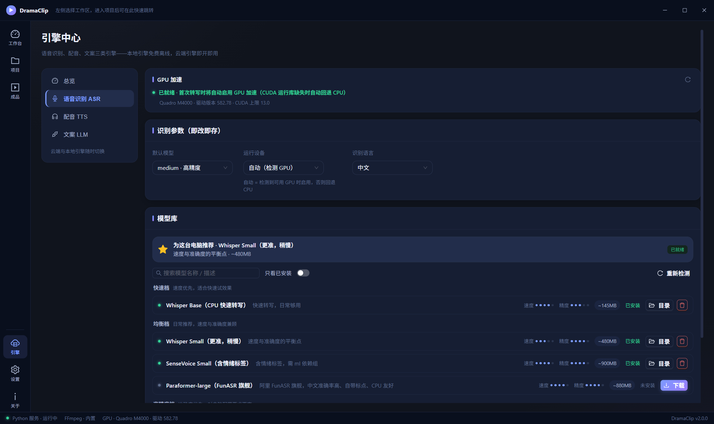

<div align="center">

# 🎬 DramaClip

**本地优先的短剧自动高光剪辑工具 —— 分析 · 编剧 · 配音 · 成片，全部在本机完成**

导入一部短剧，AI 帮你看完、写好、配完音，直接产出可发布的推广短视频。


</div>

---

## ✨ 它解决什么问题

短剧 CPS 推广的核心工作量是「看剧 → 挑高光 → 写文案 → 配音 → 剪片」，一部剧动辄几十集，人工跑一遍就是一天。DramaClip 把这条流水线压缩成一次点击：

```
导入剧集 ──► 智能分析 ──► 选择出片模式 ──► AI 编排 & 渲染 ──► 成品库
（文件夹）   （转写/场景/冲突）  （九种模式任选）    （编剧/配音/字幕/混音）  （按剧分组管理）
```

- **整剧理解**：不只看第一集——LLM 通读全部已分析集数的转写与冲突峰，跨集取材串出完整故事线
- **批量产出**：每种模式一次生成多条不同角度的方案，多模式并行渲染，一部剧一次出一片墙
- **数据不出本机**：转写、场景、配音、编码全部本地执行；LLM 是唯一可选的外部依赖，可切换本地端点实现完全离线

## 🎭 九种出片模式

| 模式 | 一句话 |
|---|---|
| 📖 **剧情解说** | 对白句级筛选，起承转合完整讲一个故事 |
| 🔀 **交叉解说** | 解说与原声交替推进，节奏感强 |
| 🎬 **片头解说** | 前置解说钩子 + 原片正片，开头 3 秒抓人 |
| ⚡ **超短悬念版** | 30 秒内钩子 + 反转收尾，适配信息流 |
| 📢 **全片解说** | 逐段解说全覆盖，信息密度最高 |
| 🎙️ **双人对谈** | 双音色对话式解说，像两位博主聊剧 |
| 💭 **内心独白** | 第一人称 OS 旁白，代入主角视角 |
| ✂️ **纯原片剪辑** | AI 挑高光直接混剪，无解说保留原声 |
| 📝 **字幕金句流** | 金句大字卡点 + CTA，无声环境也抓人 |

一键「全部生成」时多模式并行编排渲染；每条方案附带 LLM 生成的 8 条候选标题。

## 🧠 核心能力

**🔊 融合转写（OCR × ASR）**
短剧自带硬字幕，就是人工校对过的金标准。OCR 主通道与 ASR 逐段对齐投票：一致直接采用，分歧按置信度裁决，双低置信标记人工复核。繁简自动归一，画面热词（人名/地名）反向注入 ASR 提升识别。

**✍️ AI 编剧（可插拔）**
任何 OpenAI 兼容端点即插即用——云端 DashScope/Agnes，或本地 Ollama / LM Studio，同协议多配置一键切换。编剧按「基本功 + 题材口味」双层指令成稿：3 秒钩子、半句钩切段落、最大反转不剧透，拒绝剧情概述腔。未配置时分析层自动降级关键词打分，纯原片类模式不受影响。

**🎙️ 多引擎配音，音色按引擎独立**
- **Kokoro 82M（本地离线）**：100 个中文音色（55 女 + 45 男），免费、数据不出机
- **sherpa-onnx melo（本地离线）**：VITS 高音质，CPU 实时
- **微软 Edge（云端免费）**：14 个中文官方音色，覆盖普通话/东北/陕西/粤语/台湾

**🎚️ 影院级混音**
解说出现时原声自动压低避让，段间近邻衔接消除微跳跃；整片按 EBU R128 归一到 -14 LUFS，响度直接达到发布标准。

**🛡️ 智能消重**
极微变速、等比微缩放、色彩微抖动与元数据擦除缓解素材同质化；台词保护区自动避让，抖动永不吞字。

**🚀 GPU 加速，探测不到就诚实回退**
NVIDIA 显卡自动启用 NVENC 硬件编码；CUDA 运行库一键下载注入。转写性能随算力自适应（int8 量化），无显卡的机器全流程照跑。

**🖥️ 成品工作台**
成品库按剧分组、9:16 海报墙横向滑动；成片详情页内嵌播放、逐段解说文案复制、候选标题一键采用。

## 🖼️ 界面一览

| 成品库（按剧分组海报墙） | 引擎中心（配音 · 100 中文音色） |
|---|---|
|  |  |

<details>
<summary>更多界面：识别参数 · GPU 状态 · 模型库</summary>



</details>

## 🚀 快速开始

> **环境要求**：Windows 10/11 · Node.js 24+ · Python 3.12+ ·（可选）NVIDIA 显卡

```bash
git clone https://github.com/efarsoft/DramaClip.git
cd DramaClip

# 前端依赖
npm install

# Python 环境（含 ML 依赖组）
python -m venv .venv
.venv/Scripts/pip install -e "service[ml,dev]"

# 一键启动开发栈（Vite + Electron + Python 服务）
npm run dev
```

首次启动后三步就绪：

1. **引擎中心 → 语音识别**：下载一个 ASR 模型（推荐 Whisper Small，~480MB）
2. **引擎中心 → 配音**：本地 Kokoro 音色全量离线可用，或直接用云端 Edge
3. **引擎中心 → 文案 LLM**：填一个 OpenAI 兼容端点（不填也能用纯原片类模式）

## 📦 打包发布

```bash
npm run dist:service              # PyInstaller sidecar → resources/dramaclip-service/
node scripts/verify_sidecar.mjs   # sidecar 冒烟：握手/资源注入/预设/优雅退出
npm run dist                      # electron-builder → NSIS 安装包 + zip（desktop/release/）
```

## 🏗️ 架构

```
┌─────────────────────────── Electron ───────────────────────────┐
│  React 渲染层  ──►  preload 桥  ──►  主进程薄壳（IPC/窗口/媒体）  │
└────────────────────────────────┬───────────────────────────────┘
                                 │ 127.0.0.1 环回 TCP + NDJSON
                                 │  JSON-RPC 2.0（token 握手 + 心跳重启）
┌────────────────────────────────▼───────────────────────────────┐
│                        Python 服务 (dramaclip)                  │
│   api 路由 ──► engines（分析/语义/解说/字幕/TTS/消重/编码）        │
│                      └──► infra（SQLite/ffmpeg/模型管理/配置）    │
└─────────────────────────────────────────────────────────────────┘
```

协议契约以 `protocol/` 为唯一真相源（JSON Schema + TS 类型两侧同步）；SQLite 由 Python 服务独占写入。

## 📁 目录结构

```
desktop/    Electron + React 桌面应用（main/ 主进程 + src/ 渲染层）
service/    Python 本地服务（包名 dramaclip，engines + infra + api）
protocol/   三端契约唯一真相源（JSON Schema + TS 类型）
resources/  随应用分发的只读资源（ffmpeg / 字体 / 内置字幕预设）
scripts/    开发编排与验证脚本
docs/       架构决策、设计系统、协议规范、质量报告
```

## 🧰 技术栈

| 层 | 技术 |
|---|---|
| 桌面端 | Electron 44 · React 19 · TypeScript 5.9（strict）· Ant Design 6 · Vite 8 · Zustand |
| 服务端 | Python 3.12+ · Pydantic v2 · SQLite（WAL）· JSON-RPC 2.0 |
| AI / ML | faster-whisper（int8）· RapidOCR · PySceneDetect · librosa · Kokoro / sherpa-onnx · OpenAI 兼容 LLM |
| 媒体 | FFmpeg（libx264 / NVENC）· ASS 字幕烧录 · EBU R128 响度归一 |

## 📄 声明

素材授权责任由使用者承担；本软件不代为取得或证明素材授权。媒体处理全部在本机完成，素材不上传。

v1 原型封存于 `legacy/v1-electron` 分支（只读，不参与构建）。
