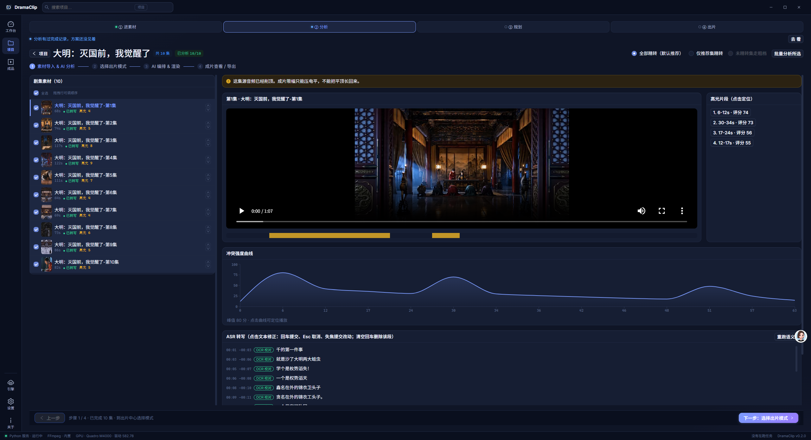
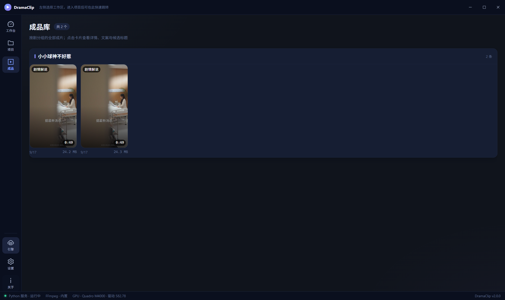
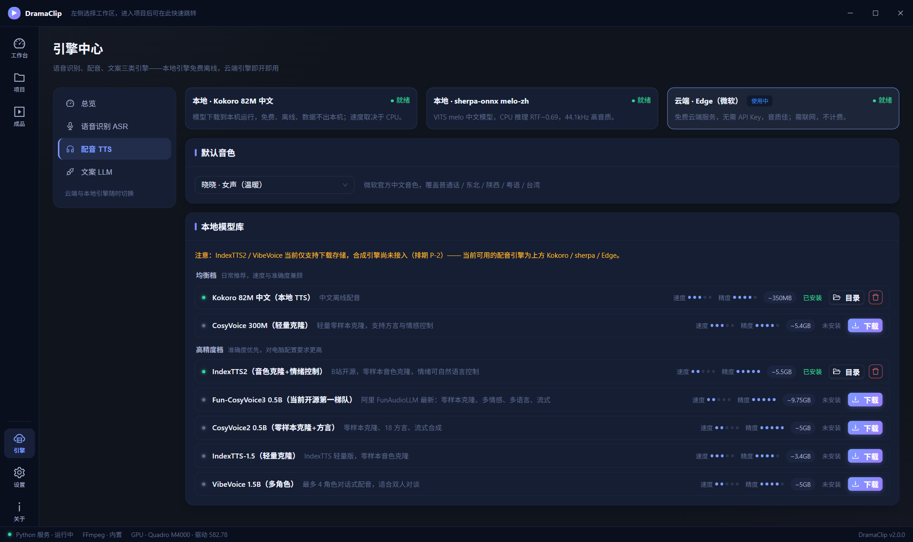

<div align="center">

# 🎬 DramaClip - 短剧自动高光剪辑工具

**本地优先的短剧 CPS 一站式出片引擎 —— 智能分析 · AI 编剧 · 多引擎配音 · 影院级混音，全流程在本机完成。**

导入一部几十集的短剧，AI 帮你看完、写好、配完音，一次产出一整面墙的可发布推广短视频。




</div>

---

## ✨ 功能特性

- 🎭 **九种出片模式，一键全部生成**：剧情解说 / 交叉解说 / 片头解说 / 超短悬念 / 全片解说 / 双人对谈 / 内心独白 / 纯原片剪辑 / 字幕金句流。多模式并行编排渲染，每种模式一次产出多条不同角度的方案，一部剧一次出一面墙。
- 🧠 **OCR × ASR 融合转写**：短剧自带硬字幕就是人工校对过的金标准。OCR 主通道与 ASR 逐段对齐投票，一致采用、分歧按置信度裁决、双低置信标记人工复核——转写准确率远超单一引擎（详见下文专节）。
- 🌐 **跨集编排**：LLM 通读全部已分析集数的转写与冲突峰，跨集取材串出完整故事线——"废柴一杆清台"式的多集反转弧线，而不是第一集的铺垫切片。
- ✍️ **AI 编剧双层指令**：基本功层（3 秒钩子、半句钩切段落、最大反转不剧透）常驻 + 题材口味层由 LLM 从风格库自选，对抗"剧情概述腔"。任何 OpenAI 兼容端点即插即用，本地 Ollama / LM Studio 同协议接入。
- 🎙️ **多引擎配音，音色按引擎独立**：本地 Kokoro **100 个中文音色**（55 女 + 45 男，全量离线免费）、sherpa-onnx melo 高音质 CPU 实时、微软 Edge 14 个官方中文音色（普通话/东北/陕西/粤语/台湾）。
- 🎚️ **影院级语音避让混音**：解说出现时原声自动压低（解说段压至 10%、衬底段 8%），段间近邻衔接消除微跳跃，整片按 **EBU R128 归一到 -14 LUFS**，响度直接达到发布标准。
- 🛡️ **智能消重与台词保护**：台词保护区避让 + 极微变速 + 微缩放 + 色彩微抖动 + 元数据擦除五重机制缓解素材同质化，抖动永不吞字（详见下文专节）。
- 🚀 **GPU 加速与诚实回退**：NVIDIA 显卡自动启用 NVENC 硬件编码（p4/hq 档），CUDA 运行库一键下载注入；探测不到就诚实回退 CPU int8，转写全引擎无显卡照跑。
- 💻 **本机运行条件检测**：显卡 / 内存 / 磁盘一键探测，逐个模型给出"可运行 / 内存不足 / 磁盘不足"结论——本地模型能不能跑，一眼可知，探测不到就明说未知。
- 💾 **全流程状态持久化**：项目 / 剧集 / 分析结果 / 方案 / 出片记录全部落本地 SQLite，随时中断随时恢复；成片按剧分组、9:16 海报墙管理，详情页逐段文案复制 + LLM 候选标题一键采用。
- 🔒 **数据不出本机**：转写、场景、配音、编码全部本地执行；LLM 是唯一可选的外部依赖，切换本地端点即可完全离线。

## 🎭 九种出片模式

| 模式 | 一句话 |
|---|---|
| 📖 **剧情解说** | 对白句级筛选，起承转合完整讲一个故事 |
| 🔀 **交叉解说** | 解说与原声交替推进，节奏感强 |
| 🎬 **片头解说** | 前置解说钩子 + 原片正片，开头 3 秒抓人 |
| ⚡ **超短悬念版** | 30 秒内钩子 + 反转收尾，适配信息流 |
| 📢 **全片解说** | 逐段解说全覆盖，信息密度最高 |
| 🎙️ **双人对谈** | 双音色对话式解说，像两位博主聊剧 |
| 💭 **内心独白** | 第一人称 OS 旁白，代入主角视角 |
| ✂️ **纯原片剪辑** | AI 挑高光直接混剪，无解说保留原声 |
| 📝 **字幕金句流** | 金句大字卡点 + CTA，无声环境也抓人 |

## 🛡️ 智能消重与语音避让系统

专门缓解短剧二创素材在短视频平台的**同质化判定**问题——五重机制全部参数化、可关闭，且绝不损伤剧情连续性：

1. **台词保护区避让（Smart Jitter）**
   - **禁止盲切**：切点由 AI 选题决定，但落点永远不吞字。
   - **保护区**：以融合转写的台词边界为基准，每行台词 `[开始 - 0.2s, 结束 + 0.15s]` 标为禁区。
   - **智能避让**：入点命中禁区自动外移；落在安静空白间隙则允许 `≤ 0.3s` 的安全随机抖动。
2. **极微变速（Micro-Speed）**：每片段随机变速 `0.996 ~ 1.004`，FFmpeg `atempo` 变速不变调，音质无损连续。
3. **微缩放（Micro-Scaling）**：随机缩小 `0.982 ~ 0.988` 后等比拉回原输出尺寸（如 1080×1920），破坏像素哈希指纹且无黑边、无分辨率偏差。
4. **色彩微抖动（Visual eq）**：对比度 `0.99 ~ 1.01`、亮度 `±0.01` 随机微幅波动，逐帧改变特征向量。
5. **元数据擦除（Metadata Cleansing）**：分段与拼接全程注入 `-map_metadata -1`，物理抹除设备标签、时间与地理信息。

**语音避让**是同一套混音管线的另一半：解说轨出现时，原声作为衬底自动压低（narration 段 `volume=0.1`、全程衬底段 `volume=0.08`），`amix` 关闭归一化并经限幅器收口，确保人声清晰不被原声淹没。

## 🧠 OCR × ASR 融合转写

单一 ASR 在短剧场景有硬伤：BGM 盖词、方言口音、繁简混杂。而短剧画面自带**逐句硬字幕**——这是片方花钱人工校对过的金标准。DramaClip 把它用足：

1. **OCR 主通道**：探针帧自适应定位字幕带（含常驻横幅排除），1fps 裁帧识别，相邻同文本自动合并；
2. **对齐投票**：OCR 条与 ASR 段时间窗聚合 + 字级对齐，一致 → 直接采用；ASR 高置信而 OCR 低置信 → 翻案采 ASR；双双低置信 → 标记人工复核；
3. **热词反哺**：画面内文字（人名/地名/专有名词）自动提炼为 ASR 热词，后续集数识别更准；
4. **繁简归一**：全链路输出统一简体。

真实剧集实测：60% 段落经 OCR 校对修正，串段、错字显著下降。

## 🛠️ 技术栈

### 桌面端
- **Electron 44** - 跨平台桌面框架（无边框窗口 + 自定义标题栏）
- **React 19 + TypeScript 5.9（strict）** - UI 与类型安全
- **Ant Design 6 + Zustand 5** - 组件库与状态管理
- **Vite 8 + Vitest 5** - 构建与测试

### 服务端
- **Python 3.12+** - 本地服务（包名 `dramaclip`）
- **JSON-RPC 2.0 over 环回 TCP + NDJSON** - 进程间通信（token 握手 + 心跳自动重启）
- **SQLite（WAL）** - 全部业务状态唯一存储，服务独占写入
- **PyInstaller** - 打包为随应用分发的 sidecar

### AI / ML
- **faster-whisper（int8）** - 逐段时间戳转写，CPU/CUDA 自适应
- **RapidOCR** - 硬字幕识别主通道
- **PySceneDetect + librosa** - 场景切割与音频能量/节奏分析
- **jieba** - 台词分词与画面热词提炼
- **Kokoro / sherpa-onnx / edge-tts** - 三引擎配音
- **OpenAI 兼容 LLM** - 编剧与语义层（云端或本地端点）

### 媒体管线
- **FFmpeg（内置随包分发）** - 滤镜链编排、ASS 字幕烧录、libx264 / NVENC 编码
- **EBU R128 loudnorm** - 成片响度归一

## 🖼️ 界面一览

| 工作台 | 成品库（按剧分组海报墙） |
|---|---|
|  |  |

<details>
<summary>更多界面：引擎中心 · 模型库 · GPU 状态</summary>



</details>

## 📦 安装

### 前置要求

- Windows 10/11
- Node.js 24+
- Python 3.12+
- FFmpeg **无需安装**（已随包内置 `resources/ffmpeg/`）
- NVIDIA 显卡可选——无显卡全流程照跑

### 安装步骤

```bash
# 1. 克隆仓库
git clone https://github.com/efarsoft/DramaClip.git
cd DramaClip

# 2. 前端依赖
npm install

# 3. Python 环境（含 ML 依赖组）
python -m venv .venv
.venv/Scripts/pip install -e "service[ml,dev]"

# 4. 一键启动开发栈（Vite + Electron + Python 服务）
npm run dev
```

首次启动后三步就绪：

1. **引擎中心 → 语音识别**：下载一个 ASR 模型（推荐 Whisper Small，~480MB）
2. **引擎中心 → 配音**：本地 Kokoro 音色全量离线可用，或直接用云端 Edge
3. **引擎中心 → 文案 LLM**：填一个 OpenAI 兼容端点（不填也能用纯原片类模式）

## 🚀 使用

### 开发模式

```bash
npm run dev     # 一键完整开发栈：Vite 热更新 + Electron + Python 源码直跑
```

> 渲染层改动即时热更新；**主进程（main/）改动必须整栈重启**，仅 HMR 会半新半旧。

### 生产构建

```bash
npm run dist:service              # PyInstaller sidecar → resources/dramaclip-service/（含 ML 依赖，约 1GB）
node scripts/verify_sidecar.mjs   # sidecar 冒烟：握手/资源注入/预设/优雅退出
npm run dist                      # electron-builder → NSIS 安装包 + zip（desktop/release/）
```

### 运行测试

```bash
npm run lint                      # 前端门禁一：ESLint（strict 型约束 + 300 行/60 行红线）
npm run typecheck                 # 前端门禁二：tsc --noEmit
npm test                          # 前端门禁三：Vitest

cd service
../.venv/Scripts/ruff.exe check dramaclip/    # Python 门禁一
../.venv/Scripts/mypy.exe dramaclip/          # Python 门禁二（strict）
../.venv/Scripts/pytest.exe tests/            # Python 门禁三
```

## ⚙️ 配置体系

DramaClip v2 采用**三层设置架构**，全部经界面即改即存，无需手改配置文件：

1. **全局偏好（SQLite `settings` 表）**：「偏好设置」页可视化管理——出片参数、转写阈值、下载镜像等；Python 服务独占写入，界面保存立即生效。
2. **引擎多实例（`engine_configs` 表）**：「引擎中心」按能力域（ASR/TTS/LLM）管理本地模型与云端配置，同域多实例、单启用，切换零重启。
3. **项目级覆盖（`projects.settings`）**：单部剧可覆盖方案数 K、转写档位、解说风格等，粒度精确到剧。

LLM 凭据在「引擎中心 → 文案 LLM」配置，支持任意 OpenAI 兼容端点（DashScope / Agnes / 本地 Ollama / LM Studio），多配置一键切换。

## 📁 项目结构

```
DramaClip/
├── desktop/                 # Electron + React 桌面应用
│   ├── main/               #   主进程薄壳（窗口/IPC/服务管理/媒体协议）
│   └── src/                #   渲染层（features 按业务域自含）
├── service/                 # Python 本地服务（包名 dramaclip）
│   └── dramaclip/
│       ├── api/            #   RPC 方法注册层
│       ├── engines/        #   业务引擎（分析/语义/解说/字幕/消重/TTS/编码）
│       └── infra/          #   基础设施（SQLite/ffmpeg/模型管理/GPU/配置）
├── protocol/                # 三端契约唯一真相源（JSON Schema + TS 类型）
├── resources/               # 随应用分发的只读资源（ffmpeg/字体/字幕预设）
├── scripts/                 # 开发编排与验证脚本
└── docs/                    # 架构决策、设计系统、协议规范、质量报告
```

## 📝 开发指南

### 代码门禁

- **TypeScript**：strict + noUncheckedIndexedAccess，禁 any，单文件 ≤300 行 / 单函数 ≤60 行
- **Python**：ruff + mypy strict，注解 100%
- **契约**：`protocol/` 唯一定义，schema 与 TS 两侧同步

### 提交规范

使用语义化提交信息：

```
feat: 新功能        fix: 修复 bug       docs: 文档更新
refactor: 重构      test: 测试相关      chore: 构建/工具相关
```

## 📄 声明

素材授权责任由使用者承担；本软件不代为取得或证明素材授权，亦不提供规避原创性检测的功能。媒体处理全部在本机完成，素材不上传。

v1 原型封存于 `legacy/v1-electron` 分支（只读，不参与构建）。
