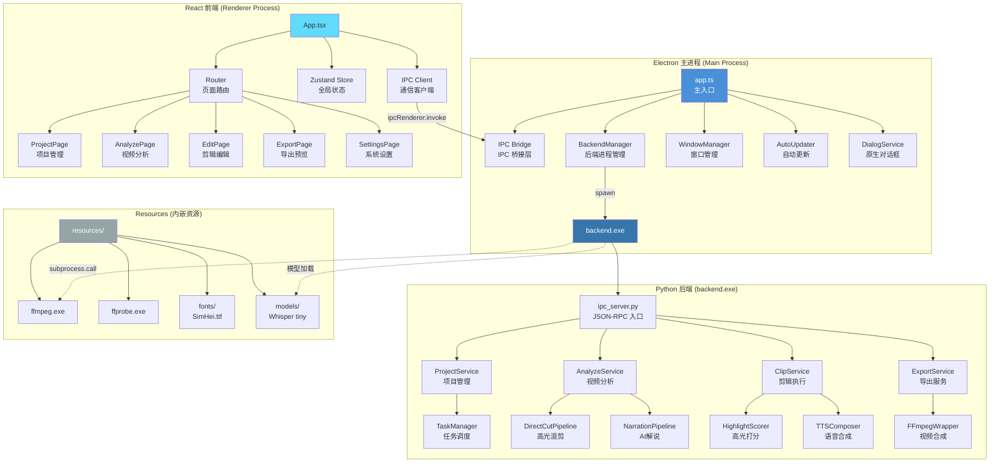
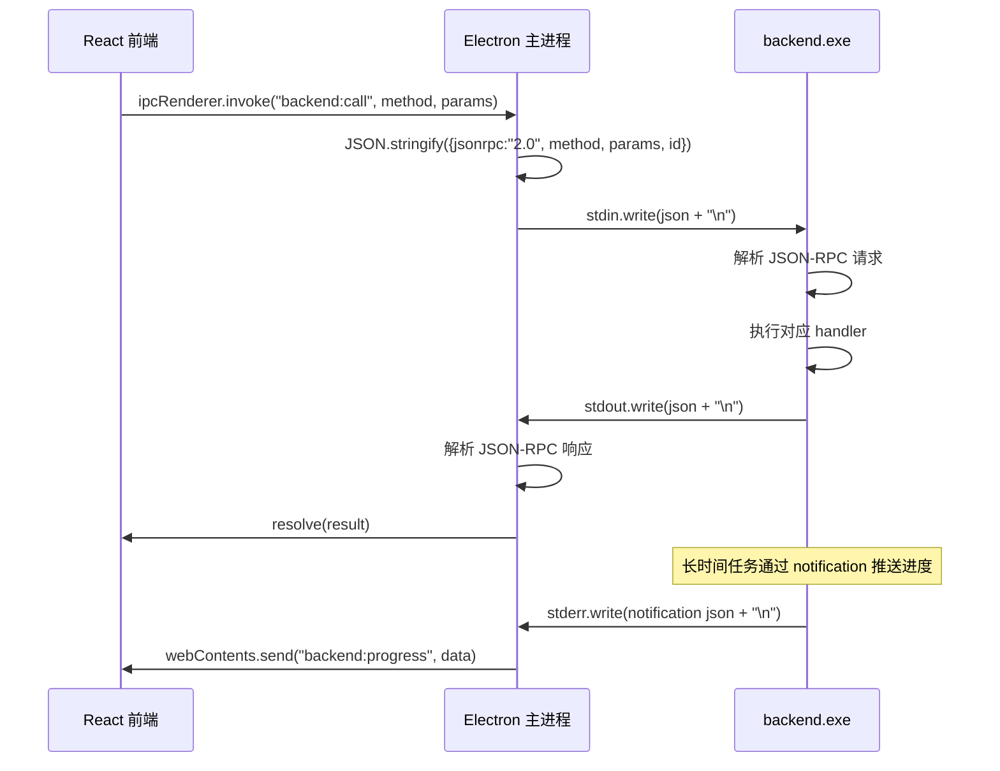
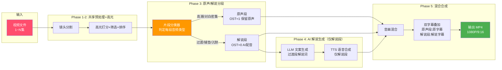
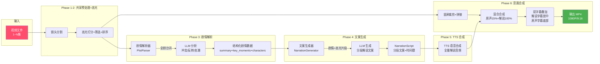
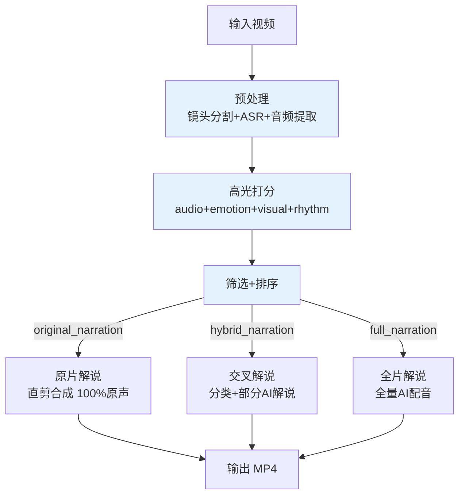

# DramaClip 桌面客户端 — 系统架构设计

**文档版本：** v1.0
**架构师：** 高见远（Gao）
**创建日期：** 2026年5月11日
**文档状态：** 评审中

---

## 1. 技术选型

### 1.1 框架选型及理由

| 层级 | 技术选型 | 版本 | 选型理由 |
|------|----------|------|----------|
| **桌面框架** | Electron | 33.x | 成熟的跨平台桌面方案；Chromium 内核保证 UI 一致性；丰富的 native API（文件对话框、系统托盘、自动更新）；社区生态完善 |
| **前端框架** | React + TypeScript | React 19 / TS 5.x | 组件化开发，状态管理清晰；TS 类型安全降低运行时错误；庞大社区与组件库生态；与 Electron 集成成熟 |
| **UI 组件库** | Ant Design 5.x | 5.x | 企业级组件库，开箱即用；Table/Progress/Tabs 等组件契合剪辑工具场景；支持主题定制 |
| **状态管理** | Zustand | 5.x | 轻量（~1KB），无 boilerplate；原生支持异步；适合中等复杂度桌面应用 |
| **后端语言** | Python | 3.10+ | 现有 `app/` 核心业务全部 Python；AI/ML 生态（Whisper、librosa、pydub）Python 独占；PyInstaller 打包成熟 |
| **后端打包** | PyInstaller | 6.x | 单文件/单目录打包；支持 `--add-data` 嵌入 FFmpeg 等资源；ONEDIR 模式启动更快 |
| **视频处理** | FFmpeg | 7.x | 行业标准；命令行调用稳定可靠；支持硬件加速（NVENC/QSV）；内嵌 resources 目录 |
| **进程通信** | child_process.spawn | — | Electron 主进程 spawn `backend.exe`，stdin/stdout JSON-RPC；比 REST 更轻量，无需端口管理；避免防火墙问题 |
| **打包分发** | electron-builder | 25.x | NSIS 安装程序；自动更新（electron-updater）；代码签名；多配置输出（portable/exe） |
| **构建工具** | Vite | 6.x | 极速 HMR；原生 TS/ESM 支持；Rollup 生产构建 |

### 1.2 依赖包列表

#### Electron 主进程 + React 前端

```json
{
  "dependencies": {
    "react": "^19.0.0",
    "react-dom": "^19.0.0",
    "react-router-dom": "^7.0.0",
    "antd": "^5.22.0",
    "@ant-design/icons": "^5.5.0",
    "zustand": "^5.0.0",
    "dayjs": "^1.11.0",
    "uuid": "^11.0.0"
  },
  "devDependencies": {
    "electron": "^33.0.0",
    "electron-builder": "^25.0.0",
    "vite": "^6.0.0",
    "@vitejs/plugin-react": "^4.3.0",
    "typescript": "^5.7.0",
    "@types/react": "^19.0.0",
    "@types/react-dom": "^19.0.0",
    "eslint": "^9.0.0",
    "prettier": "^3.4.0",
    "concurrently": "^9.0.0",
    "wait-on": "^8.0.0"
  }
}
```

#### Python 后端（从现有 `requirements.txt` 演进）

```
# ===== 核心依赖 =====
pydantic>=2.0.0              # 数据模型（从 Pydantic v1 升级）
loguru>=0.7.3                # 日志
tomli>=2.2.1                 # TOML 解析
tomli-w>=1.0.0               # TOML 写入
tenacity>=9.0.0              # 重试机制

# ===== 视频处理 =====
moviepy==2.1.1               # 视频剪辑辅助
pysrt==1.1.2                 # SRT 字幕处理
pydub==0.25.1                # 音频处理
Pillow>=10.3.0               # 图像处理
tqdm>=4.66.6                 # 进度条

# ===== AI 服务 =====
openai>=1.77.0               # LLM API（OpenAI 兼容）
google-generativeai>=0.8.5   # Gemini（视觉分析）

# ===== 高光分析 =====
scenedetect>=0.7             # 镜头分割
librosa>=0.10.0              # 音频分析
soundfile>=0.12.0            # 音频读写
opencv-python>=4.11.0        # 图像/人脸检测
jieba>=0.42.1                # 中文分词

# ===== TTS 引擎 =====
edge-tts==7.2.7              # Edge TTS（免费离线）
azure-cognitiveservices-speech>=1.37.0  # Azure TTS（可选）
tencentcloud-sdk-python>=3.0.1200        # 腾讯 TTS（可选）

# ===== IPC 层新增 =====
jsonrpcserver>=5.0.0         # JSON-RPC 服务端

# ===== PyInstaller 打包 =====
pyinstaller>=6.0.0           # 打包为 backend.exe
```

#### 移除的依赖（桌面版不再需要）

```
streamlit>=1.45.0            # Web UI — 由 Electron + React 替代
watchdog==6.0.0              # 文件监控 — Streamlit 专用
requests>=2.32.0             # HTTP — 由内置 urllib 替代（减少打包体积）
```

---

## 2. 架构设计

### 2.1 整体架构图



### 2.2 模块职责划分

#### 2.2.1 Electron 主进程

| 模块 | 文件 | 职责 |
|------|------|------|
| **app.ts** | `main/app.ts` | 应用入口，创建窗口，注册 IPC handler，管理生命周期 |
| **IPC Bridge** | `main/ipc/bridge.ts` | 注册所有 `ipcMain.handle` 通道，转发前端请求到 backend.exe |
| **BackendManager** | `main/backend/manager.ts` | spawn/manage backend.exe 进程；处理启动、心跳检测、异常重启、优雅退出 |
| **WindowManager** | `main/window/manager.ts` | 主窗口创建/销毁/最小化；窗口状态持久化（位置、尺寸） |
| **DialogService** | `main/services/dialog.ts` | 原生文件选择对话框（打开文件/文件夹、保存文件） |
| **AutoUpdater** | `main/updater.ts` | electron-updater 自动更新检查与安装 |

#### 2.2.2 React 前端（Renderer Process）

| 模块 | 目录 | 职责 |
|------|------|------|
| **Pages** | `src/pages/` | 5 个页面组件：项目、分析、剪辑、导出、设置 |
| **Components** | `src/components/` | 可复用 UI 组件：VideoPlayer、Timeline、ScoreChart、SegmentCard |
| **Stores** | `src/stores/` | Zustand 状态管理：projectStore、analysisStore、clipStore、uiStore |
| **IPC Client** | `src/services/ipc.ts` | 封装 `ipcRenderer.invoke`，提供类型安全的 API 调用 |
| **Hooks** | `src/hooks/` | 自定义 Hook：useAnalysis、useExportProgress、useTaskPolling |
| **Types** | `src/types/` | TypeScript 类型定义，与 Python 后端 schema 对齐 |

#### 2.2.3 Python 后端（backend.exe）

| 模块 | 目录 | 职责 |
|------|------|------|
| **IPC Server** | `app/ipc/` | JSON-RPC 服务端，读取 stdin JSON 请求，写入 stdout JSON 响应 |
| **ProjectService** | `app/services/project/` | 项目 CRUD、项目目录管理、元数据读写 |
| **AnalyzeService** | `app/services/analyze/` | ASR 语音识别、角色分离、情绪曲线分析、高光识别 |
| **ClipService** | `app/services/clip/` | 三种剪辑方案的执行入口，任务调度与进度回报 |
| **ExportService** | `app/services/export/` | 视频合成、参数配置、导出进度跟踪 |
| **DirectCutPipeline** | `app/services/direct_cut/` | 高光混剪完整流水线（保留原声） |
| **NarrationPipeline** | `app/services/narration/` | AI 解说流水线（剧情解析 → 文案 → TTS → 合成） |
| **TransitionPipeline** | `app/services/transition/` | 解说过渡流水线（原声+AI 交替，新增） |
| **HighlightScorer** | `app/services/highlight/` | 多维高光打分引擎 |
| **LLMService** | `app/services/llm/` | 统一 LLM 调用（OpenAI 兼容接口） |
| **TTSComposer** | `app/services/tts/` | TTS 语音合成管理器 |
| **FFmpegWrapper** | `app/utils/ffmpeg_utils.py` | FFmpeg 命令封装 |

### 2.3 IPC 通信设计

#### 2.3.1 通信架构



#### 2.3.2 JSON-RPC 协议规范

**请求格式（前端 → 主进程 → backend.exe）**

```json
{
  "jsonrpc": "2.0",
  "method": "project.create",
  "params": { "name": "我的短剧", "path": "D:/Videos/drama1" },
  "id": 1
}
```

**响应格式（backend.exe → 主进程 → 前端）**

```json
{
  "jsonrpc": "2.0",
  "result": { "project_id": "abc-123", "name": "我的短剧" },
  "id": 1
}
```

**错误格式**

```json
{
  "jsonrpc": "2.0",
  "error": { "code": -32001, "message": "视频文件不存在", "data": { "path": "xxx.mp4" } },
  "id": 1
}
```

**进度通知（backend.exe → 主进程，无 id）**

```json
{
  "jsonrpc": "2.0",
  "method": "progress.update",
  "params": { "task_id": "abc-123", "progress": 45, "message": "正在高光打分..." }
}
```

#### 2.3.3 IPC 通道注册表

| 通道名 | 方向 | 方法 | 说明 |
|--------|------|------|------|
| `dialog:openFile` | R→M | — | 打开文件选择对话框 |
| `dialog:openFolder` | R→M | — | 打开文件夹选择对话框 |
| `dialog:saveFile` | R→M | — | 保存文件对话框 |
| `backend:call` | R→M→B | 任意 RPC 方法 | 通用后端调用通道 |
| `backend:progress` | B→M→R | `progress.update` | 进度推送通知 |
| `backend:log` | B→M→R | `log.append` | 后端日志推送 |
| `backend:ready` | B→M | — | 后端启动就绪信号 |
| `backend:error` | B→M→R | — | 后端异常通知 |

#### 2.3.4 核心 RPC 方法清单

| 命名空间 | 方法 | 参数 | 返回 |
|----------|------|------|------|
| `project` | `list` | `{}` | `Project[]` |
| `project` | `create` | `{name, path}` | `Project` |
| `project` | `open` | `{project_id}` | `Project` |
| `project` | `delete` | `{project_id}` | `{success}` |
| `project` | `importVideos` | `{project_id, paths[]}` | `Episode[]` |
| `analyze` | `start` | `{project_id, episode_ids[]}` | `{task_id}` |
| `analyze` | `getStatus` | `{task_id}` | `AnalysisResult` |
| `analyze` | `cancel` | `{task_id}` | `{success}` |
| `clip` | `recommend` | `{project_id}` | `Recommendation` |
| `clip` | `execute` | `{project_id, scheme, params}` | `{task_id}` |
| `clip` | `getProgress` | `{task_id}` | `ClipProgress` |
| `clip` | `preview` | `{project_id, scheme}` | `{preview_url}` |
| `export` | `start` | `{project_id, output_config}` | `{task_id}` |
| `export` | `getProgress` | `{task_id}` | `ExportProgress` |
| `settings` | `get` | `{}` | `AppSettings` |
| `settings` | `update` | `{settings}` | `{success}` |
| `system` | `getVersion` | `{}` | `{version}` |
| `system` | `getFFmpegInfo` | `{}` | `{available, version, hwaccel}` |

---

## 3. 文件结构

### 3.1 完整目录结构

```
DramaClip/
├── package.json                      # Electron + React 项目配置
├── tsconfig.json                     # TypeScript 配置
├── vite.config.ts                    # Vite 构建配置
├── electron-builder.yml              # electron-builder 打包配置
│
├── main/                             # ===== Electron 主进程 =====
│   ├── app.ts                        # 应用入口
│   ├── ipc/
│   │   ├── bridge.ts                 # IPC 通道注册与转发
│   │   └── channels.ts               # 通道名常量定义
│   ├── backend/
│   │   ├── manager.ts                # backend.exe 进程管理
│   │   ├── protocol.ts               # JSON-RPC 协议编解码
│   │   └── launcher.ts               # 后端启动与发现
│   ├── window/
│   │   └── manager.ts                # 窗口管理
│   ├── services/
│   │   └── dialog.ts                 # 原生对话框服务
│   └── updater.ts                    # 自动更新
│
├── src/                              # ===== React 前端 (Renderer) =====
│   ├── App.tsx                       # 应用根组件
│   ├── main.tsx                      # React 入口
│   ├── router.tsx                    # 路由配置
│   │
│   ├── pages/                        # 页面组件
│   │   ├── ProjectPage.tsx           # Step1: 项目管理
│   │   ├── AnalyzePage.tsx           # Step2: 视频分析
│   │   ├── RecommendPage.tsx         # Step3: 内容分析+方案推荐
│   │   ├── EditPage.tsx              # Step4: 剪辑编辑
│   │   ├── ExportPage.tsx            # Step5: 导出预览
│   │   └── SettingsPage.tsx          # 系统设置
│   │
│   ├── components/                   # 可复用组件
│   │   ├── layout/
│   │   │   ├── AppLayout.tsx         # 整体布局（侧边栏+内容区）
│   │   │   ├── Sidebar.tsx           # 导航侧边栏
│   │   │   └── StatusBar.tsx         # 底部状态栏
│   │   ├── player/
│   │   │   ├── VideoPlayer.tsx       # 视频播放器
│   │   │   └── PreviewPlayer.tsx     # 片段预览播放器
│   │   ├── timeline/
│   │   │   ├── SegmentTimeline.tsx   # 片段时间轴
│   │   │   └── SegmentCard.tsx       # 片段卡片
│   │   ├── chart/
│   │   │   ├── EmotionCurve.tsx      # 情绪曲线图
│   │   │   └── ScoreRadar.tsx        # 评分雷达图
│   │   ├── project/
│   │   │   ├── ProjectCard.tsx       # 项目卡片
│   │   │   └── ProjectList.tsx       # 项目列表
│   │   └── common/
│   │       ├── ProgressBar.tsx       # 进度条
│   │       ├── FileDropZone.tsx      # 文件拖拽区
│   │       └── StepIndicator.tsx     # 步骤指示器
│   │
│   ├── stores/                       # Zustand 状态管理
│   │   ├── projectStore.ts           # 项目状态
│   │   ├── analysisStore.ts          # 分析状态
│   │   ├── clipStore.ts              # 剪辑状态
│   │   ├── exportStore.ts            # 导出状态
│   │   └── uiStore.ts                # UI 全局状态
│   │
│   ├── services/                     # 前端服务层
│   │   ├── ipc.ts                    # IPC 通信客户端（类型安全封装）
│   │   └── taskPolling.ts            # 任务轮询服务
│   │
│   ├── hooks/                        # 自定义 Hook
│   │   ├── useAnalysis.ts            # 分析流程 Hook
│   │   ├── useExportProgress.ts      # 导出进度 Hook
│   │   └── useTaskPolling.ts         # 任务状态轮询 Hook
│   │
│   ├── types/                        # TypeScript 类型定义
│   │   ├── project.ts                # 项目相关类型
│   │   ├── analysis.ts               # 分析相关类型
│   │   ├── clip.ts                   # 剪辑相关类型
│   │   ├── export.ts                 # 导出相关类型
│   │   └── ipc.ts                    # IPC 通信类型
│   │
│   └── styles/                       # 全局样式
│       ├── global.css                # 全局 CSS
│       ├── theme.ts                  # Ant Design 主题配置
│       └── variables.css             # CSS 变量
│
├── app/                              # ===== Python 后端 =====
│   ├── ipc/                          # IPC 通信层（新增）
│   │   ├── __init__.py
│   │   ├── server.py                 # JSON-RPC 服务端（stdin/stdout）
│   │   ├── router.py                 # 方法路由与分发
│   │   └── protocol.py               # JSON-RPC 协议定义
│   │
│   ├── config/                       # 配置管理（保留，重构）
│   │   ├── __init__.py
│   │   ├── config.py                 # 全局配置管理
│   │   ├── defaults.py               # 默认配置常量
│   │   ├── audio_config.py           # 音频配置
│   │   └── ffmpeg_config.py          # FFmpeg 配置
│   │
│   ├── models/                       # 数据模型（保留，扩展）
│   │   ├── __init__.py
│   │   ├── schema.py                 # Pydantic 数据模型
│   │   ├── const.py                  # 常量定义
│   │   └── exception.py              # 自定义异常
│   │
│   ├── services/                     # 业务服务层（保留，重构）
│   │   ├── project/                  # 项目管理服务（新增）
│   │   │   ├── __init__.py
│   │   │   └── manager.py            # 项目 CRUD
│   │   ├── analyze/                  # 分析服务（从现有模块重组）
│   │   │   ├── __init__.py
│   │   │   ├── asr_service.py        # ASR 语音识别
│   │   │   ├── face_service.py       # 人脸检测/角色识别
│   │   │   └── emotion_service.py    # 情绪分析
│   │   ├── clip/                     # 剪辑服务（新增，任务调度入口）
│   │   │   ├── __init__.py
│   │   │   ├── clip_service.py       # 统一剪辑入口
│   │   │   └── recommend_service.py  # 方案推荐
│   │   ├── export/                   # 导出服务（新增）
│   │   │   ├── __init__.py
│   │   │   └── export_service.py     # 导出执行与进度
│   │   ├── direct_cut/               # 高光混剪流水线（保留）
│   │   │   ├── __init__.py
│   │   │   └── pipeline.py
│   │   ├── narration/                # AI解说流水线（保留）
│   │   │   ├── __init__.py
│   │   │   └── pipeline.py
│   │   ├── transition/               # 解说过渡流水线（新增）
│   │   │   ├── __init__.py
│   │   │   └── pipeline.py
│   │   ├── highlight/                # 高光分析引擎（保留）
│   │   │   ├── __init__.py
│   │   │   ├── scene_detect.py
│   │   │   ├── scorer.py
│   │   │   ├── selector.py
│   │   │   ├── audio_scorer.py
│   │   │   ├── emotion_scorer.py
│   │   │   ├── visual_scorer.py
│   │   │   └── rhythm_scorer.py
│   │   ├── llm/                      # LLM 服务（保留）
│   │   │   ├── __init__.py
│   │   │   ├── unified_service.py
│   │   │   ├── manager.py
│   │   │   └── ...
│   │   ├── tts/                      # TTS 服务（从 voice.py 拆分）
│   │   │   ├── __init__.py
│   │   │   └── composer.py
│   │   ├── prompts/                  # Prompt 模板（保留）
│   │   │   └── ...
│   │   ├── sorter/                   # 排序引擎（保留）
│   │   │   └── ...
│   │   ├── task.py                   # 任务调度（保留，适配 IPC）
│   │   ├── state.py                  # 状态管理（保留，适配 IPC）
│   │   ├── generate_video.py         # 视频合成（保留）
│   │   ├── audio_merger.py           # 音频合并（保留）
│   │   ├── audio_normalizer.py       # 音频均衡（保留）
│   │   ├── clip_video.py             # 视频裁剪（保留）
│   │   ├── merger_video.py           # 视频合并（保留）
│   │   └── subtitle_merger.py        # 字幕合并（保留）
│   │
│   ├── utils/                        # 工具函数（保留）
│   │   ├── __init__.py
│   │   ├── utils.py
│   │   ├── ffmpeg_utils.py
│   │   ├── video_utils.py
│   │   ├── srt_utils.py
│   │   └── ...
│   │
│   └── backend_main.py              # backend.exe 入口（新增）
│
├── resources/                        # ===== 内嵌资源 =====
│   ├── ffmpeg.exe                    # FFmpeg 可执行文件
│   ├── ffprobe.exe                   # FFprobe 可执行文件
│   ├── fonts/                        # 字体文件
│   │   └── SimHei.ttf
│   └── models/                       # AI 模型（按需下载）
│       └── whisper-tiny/
│
├── scripts/                          # ===== 构建/开发脚本 =====
│   ├── build-backend.py              # PyInstaller 打包后端
│   ├── dev.ts                        # 开发启动脚本
│   └── pack.ts                       # 生产打包脚本
│
├── docs/                             # 文档
│   ├── Architecture_DramaClip.md     # 本文档
│   └── PRD_DramaClip_v1.0.md        # 产品需求文档
│
├── storage/                          # 运行时数据目录
│   ├── projects/                     # 项目数据
│   └── temp/                         # 临时文件
│
├── tests/                            # 测试
│   ├── main/                         # 主进程测试
│   ├── src/                          # 前端测试
│   └── app/                          # 后端测试
│
└── .workbuddy/                       # 项目管理
```

### 3.2 关键文件说明

| 文件 | 重要度 | 说明 |
|------|--------|------|
| `main/backend/manager.ts` | **核心** | backend.exe 的生命周期管理，是整个通信链路的枢纽 |
| `main/ipc/bridge.ts` | **核心** | 前端 IPC 请求到后端 RPC 的桥接，定义所有通道 |
| `src/services/ipc.ts` | **核心** | 前端类型安全的 IPC 调用封装，所有页面通过此模块与后端交互 |
| `app/ipc/server.py` | **核心** | Python 端 JSON-RPC 服务端，stdin/stdout 读写循环 |
| `app/backend_main.py` | **核心** | Python 后端入口，初始化服务、启动 IPC server |
| `app/services/clip/clip_service.py` | **核心** | 三种方案的统一调度入口，根据 scheme 分流 |
| `app/services/transition/pipeline.py` | **新增** | 解说过渡流水线，原声+AI 交替模式 |
| `app/services/project/manager.py` | **新增** | 项目管理，替代 Streamlit session_state |

---

## 4. 三种剪辑方案实现

### 4.1 方案对比

| 维度 | 原片解说 | 交叉解说 | 全片解说 |
|------|----------|----------|----------|
| **代号** | `original_narration` | `hybrid_narration` | `full_narration` |
| **音频** | 100% 原声 | 原声+AI 交替 | 100% AI 配音 |
| **原声处理** | 完整保留 | 高光段保留原声，过渡段 AI 解说 | 原声降至 15% 背景 |
| **字幕** | ASR 原声字幕 | 原声段原字幕 + AI段解说字幕 | 解说字幕（居中）+ 原声字幕（底部） |
| **TTS** | 无 | 过渡段使用 | 全程使用 |
| **LLM** | 无 | 过渡段文案生成 | 全程剧情解析+文案生成 |
| **复杂度** | 低 | 中 | 高 |
| **适用场景** | 名场面混剪、卡点视频 | 剧情连贯+节奏变化 | 剧情解说、几分钟看完 |

### 4.2 原片解说（original_narration）数据流


**核心逻辑**：直接复用现有 `DirectCutPipeline`，无需 TTS/LLM。

### 4.3 交叉解说（hybrid_narration）数据流



**新增核心模块 — 片段分类器 `SegmentClassifier`**：

```python
class SegmentClassifier:
    """
    解说过渡模式的核心决策模块

    为每个高光片段判定音频类型：
    - OST=1（原声段）：高潮对白、情绪爆点、名场面
    - OST=0（解说段）：铺垫、沉默、过渡、低情绪段

    判定维度：
    1. 情绪得分 > 阈值 → 原声段
    2. 台词密度 > 阈值 → 原声段
    3. 音频能量 > 阈值 → 原声段
    4. 相邻原声段间距 > 最小间隔 → 插入解说段
    """
    def classify(self, segments: List[SceneSegment]) -> List[ClassifiedSegment]:
        ...
```

**混合合成逻辑**：

- 原声段：保留原始音轨，原声音量 1.0，叠加原声字幕
- 解说段：原声降至 15% 背景，TTS 解说音量 1.0，叠加解说字幕
- 段间过渡：0.5s 交叉淡入淡出（audio crossfade），确保听感自然

### 4.4 全片解说（full_narration）数据流



**核心逻辑**：直接复用现有 `NarrationPipeline`，无重大改动。

### 4.5 三方案共享流程



**关键设计原则**：三种方案共享 Phase 1-2（预处理+高光打分），仅在 Phase 3 开始分流。这意味着：
- 用户切换方案无需重新分析视频
- 分析结果可在三种方案间复用
- 预处理是性能瓶颈，一次分析多次使用

**🚨 核心硬约束 — 叙事连贯性（所有模式强制遵守）**：
- 片段选择必须**以叙事线为核心主线**，不得仅按高光分数高低取 Top-N
- 选取的片段集合应形成**可理解的故事链条**：起因→发展→高潮→结局
- 片段之间若存在剧情跳跃，需通过 AI 解说（交叉/全片模式）**补全叙事桥梁**
- 原片解说模式下，片段排列必须严格遵循**原剧集内时间顺序**，不允许跨片段跳跃后导致情节断裂
- 情绪曲线应呈现**合理的起伏节奏**，而非一股脑堆叠所有高光片段
- 短时长截断（output_duration > 0）时，优先删除**叙事冗余片段**而非随机低分片段

**时长控制**：输出时长为可选参数，默认不限制。
- `output_duration` = `null` / `undefined` → 保留所有高光片段，不限总时长
- `output_duration` > 0 → 按优先级截断低分片段以适配目标时长
- 适用于 3~5 集短剧场景，固定时长场景下自动从末尾删除最低分片段

**版本控制**（v1.1 新增）：
- `version_count`：每种模式生成的版本数量，最小 1，不设上限，默认 1
- 「全部生成」（`all`）模式下，三种模式均按 `version_count` 各生成 N 份输出
- 不同版本通过 AI 差异化生成（片段组合微调、解说词改写、标题多样化）

**爆款标题**（v1.1 新增）：
- 每次输出文件名由 LLM 生成爆款标题，不同版本标题差异化
- 标题风格：短句 + 悬念/情绪词 + 热度关键词
- 示例：「全网都在找的爆款短剧，3分钟带你重温名场面🔥」
- 标题在前端预览阶段提供修改机会（用户在导出前可手动编辑文件名）

---

## 5. 任务分解

### 5.1 设计决策：输出时长 & 版本数量

> **输出时长**为可选配置，默认不限制。适用于 3~5 集短剧的完整剪辑场景。
> - 前端：三种方案右侧参数面板均提供输出时长滑块（0~300秒，0=不限）
> - 后端：`selector._truncate_to_duration(segments, output_duration)` 在方案执行时按**叙事优先级**（保留主线关键节点，裁减旁支/重复性片段）截断
> - 用户不设置时长时，保留所有高光片段，不限总时长
> - 🚨 **任何截断操作不得破坏剧情连贯性**：截断后必须保证主线事件的因果完整性，不允许出现「前一秒在求婚、后一秒在分手」的逻辑断裂
> 
> **版本数量**（v1.1）：
> - 每种模式可生成 N 个版本（最小 1，不设上限，默认 1）
> - 「全部生成」模式下三种模式均按此数量各输出 N 份
> - 不同版本通过 AI 差异化（片段微调、解说改写、爆款标题多样化），但**每个版本都必须独立满足叙事连贯性要求**

### 5.2 有序任务列表

| # | 任务 | 依赖 | 优先级 | 预估工时 | 说明 |
|----|------|------|--------|----------|------|
| T1 | 项目脚手架搭建 | — | P0 | 2d | Electron + React + Vite 初始化；Python 后端目录调整；TypeScript/ESLint/Prettier 配置 |
| T2 | IPC 通信框架 | T1 | P0 | 3d | Python JSON-RPC server；Electron BackendManager；前端 IPC Client；端到端通信验证 |
| T3 | Electron 主进程骨架 | T1 | P0 | 2d | 窗口管理、应用生命周期、原生对话框、FFmpeg 资源发现 |
| T4 | React 前端骨架 | T1 | P0 | 2d | 路由配置、AppLayout、Sidebar、StepIndicator、主题配置 |
| T5 | 项目管理模块 | T2, T3, T4 | P0 | 3d | Python ProjectService；前端 ProjectPage/ProjectCard；新建/打开/删除项目流程 |
| T6 | 视频导入与分析模块 | T5 | P0 | 5d | ASR 语音识别集成；角色分离；分析进度推送；AnalyzePage UI；EmotionCurve 图表 |
| T7 | 原片解说方案 | T6 | P0 | 3d | DirectCutPipeline 适配 IPC；EditPage 原片解说 Tab；片段预览+排序；**输出时长滑块+截断逻辑** |
| T8 | 全片解说方案 | T6 | P0 | 4d | NarrationPipeline 适配 IPC；EditPage 全片解说 Tab；双字幕 UI；**输出时长滑块+截断逻辑** |
| T9 | 交叉解说方案 | T7, T8 | P1 | 5d | SegmentClassifier 分类器；TransitionPipeline 流水线；EditPage 交叉解说 Tab；交叉淡入淡出；**输出时长滑块+截断逻辑** |
| T10 | 全部生成 | T7, T8, T9 | P1 | 3d | 三种模式批量调度；并行执行；**统一 version_count 参数分发** |
| T11 | 方案推荐引擎 | T6 | P1 | 2d | 基于剧情分析结果推荐最优方案；RecommendPage UI |
| T12 | 版本数量参数 | T7 | P1 | 1d | 前端输入组件；IPC 传递 version_count；后端 pipeline 多版本差异化生成 |
| T13 | 爆款标题生成 | T7, T8 | P1 | 2d | LLM 生成爆款标题；不同版本标题差异化；标题预览+人工修改 |
| T14 | 导出模块 | T7 | P0 | 3d | ExportService；ExportPage UI；参数配置；导出进度；输出参数中嵌入 output_duration + version_count |
| T15 | 视频播放器 | T4 | P1 | 2d | 内置播放器组件（基于 HTML5 video）；片段预览；播放控制 |
| T16 | 反思优化模块 | T7, T8, T14 | P1 | 3d | 成品评分 UI；片段标记（喜欢/不喜欢）；反馈记录；评分数据存储 |
| T17 | 设置页面 | T4 | P1 | 2d | SettingsPage；API Key 配置；输出默认值；FFmpeg 硬件加速检测 |
| T18 | 后端 PyInstaller 打包 | T2 | P0 | 2d | backend.exe 打包配置；FFmpeg 嵌入；资源路径适配；启动时间优化 |
| T19 | electron-builder 打包 | T3, T18 | P0 | 2d | Setup.exe 配置；NSIS 安装程序；代码签名；自动更新 |
| T20 | 端到端集成测试 | T19 | P0 | 3d | 完整用户流程测试；三种方案端到端验证；异常场景测试；**duration=null 和 duration>0 两种模式验证**；version_count 多版本验证 |
| T21 | 性能优化 | T20 | P2 | 3d | 启动时间优化；内存占用控制；GPU 加速集成；大文件处理优化 |

### 5.3 关键路径

```
T1 → T2 → T5 → T6 → T7 → T11 → T15 → T16 → T17
                ↘ T8 ↗
```

**关键路径预估**：2 + 3 + 3 + 5 + 3 + 3 + 2 + 2 + 3 = **26 个工作日**

| 里程碑 | 包含任务 | 交付物 | 预计时间 |
|--------|----------|--------|----------|
| **M1: 通信验证** | T1-T4 | Electron+React 启动，与 backend.exe 双向通信通过 | 第 2 周 |
| **M2: 核心流程** | T5-T8 | 项目创建→视频分析→高光混剪/AI解读→导出 完整闭环 | 第 5 周 |
| **M3: 功能完整** | T9-T14 | 三方案+推荐+播放器+反思+设置 | 第 8 周 |
| **M4: 可发布** | T15-T18 | 打包+测试+优化，可分发的 Setup.exe | 第 10 周 |

---

## 6. 共享知识约定

### 6.1 命名规范

#### 文件命名

| 类别 | 规范 | 示例 |
|------|------|------|
| React 组件 | PascalCase | `ProjectPage.tsx`, `VideoPlayer.tsx` |
| React hooks | camelCase, use 前缀 | `useAnalysis.ts`, `useTaskPolling.ts` |
| Zustand stores | camelCase, Store 后缀 | `projectStore.ts`, `clipStore.ts` |
| TypeScript 类型 | PascalCase | `Project`, `AnalysisResult`, `ClipParams` |
| Electron 主进程 | camelCase | `bridge.ts`, `manager.ts` |
| Python 模块 | snake_case | `clip_service.py`, `scene_detect.py` |
| Python 类 | PascalCase | `DirectCutPipeline`, `HighlightScorer` |
| Python 函数/方法 | snake_case | `start_analysis()`, `get_task()` |
| 测试文件 | 被测文件名 + `_test` 或 `test_` 前缀 | `bridge.test.ts`, `test_clip_service.py` |

#### 代码命名

| 类别 | 规范 | 示例 |
|------|------|------|
| IPC 通道 | `namespace:action` | `backend:call`, `dialog:openFile` |
| RPC 方法 | `namespace.method` | `project.create`, `clip.execute` |
| 事件名 | `source:event` | `backend:progress`, `backend:log` |
| 环境变量 | `DRAMACLIP_` 前缀, UPPER_SNAKE | `DRAMACLIP_BACKEND_PORT`, `DRAMACLIP_FFMPEG_PATH` |
| 常量 | UPPER_SNAKE_CASE | `MAX_FILE_SIZE`, `DEFAULT_FPS` |
| 枚举值 | UPPER_SNAKE_CASE | `TASK_STATE_PROCESSING`, `CLIP_MODE_DIRECT_CUT` |

### 6.2 接口规范

#### 前后端类型同步策略

Python `Pydantic` 模型与 TypeScript 类型需保持一致。采用**手动对齐 + 构建时校验**策略：

1. Python 端 `app/models/schema.py` 定义权威数据模型
2. TypeScript 端 `src/types/` 定义对应类型，字段名和结构保持一致
3. 构建脚本自动生成类型对照报告（可选，后续迭代）

#### 核心类型对齐示例

**Python 端** (`app/models/schema.py`)：

```python
class ClipMode(str, Enum):
    ORIGINAL_NARRATION = "original_narration"  # 原片解说
    HYBRID_NARRATION = "hybrid_narration"     # 交叉解说
    FULL_NARRATION = "full_narration"         # 全片解说
    ALL = "all"                                # 全部生成
```

**TypeScript 端** (`src/types/clip.ts`)：

```typescript
export type ClipMode =
  | "original_narration"
  | "hybrid_narration"
  | "full_narration"
  | "all";

export interface ClipParams {
  projectId: string;
  scheme: ClipMode;
  outputDuration?: number;       // 目标时长（秒），undefined=不限
  versionCount?: number;         // 版本数量，默认 1，最小 1，无上限
  // 以下为公共参数
  highlightThreshold?: number;   // 高光阈值
  ttsEngine?: string;            // TTS 引擎
  voiceName?: string;            // 音色
  voiceRate?: number;            // 语速
}
```

#### 进度推送规范

所有长时间任务必须通过 `progress.update` 通知推送进度：

```json
{
  "jsonrpc": "2.0",
  "method": "progress.update",
  "params": {
    "task_id": "abc-123",
    "progress": 45,
    "phase": "scoring",
    "message": "正在进行高光打分分析...",
    "detail": {
      "current": 3,
      "total": 7,
      "episode_index": 2
    }
  }
}
```

#### 错误码规范

| 范围 | 含义 | 示例 |
|------|------|------|
| -32000 ~ -32099 | 系统级错误 | -32001: 文件不存在, -32002: 权限不足 |
| -32100 ~ -32199 | 项目错误 | -32101: 项目不存在, -32102: 项目已存在 |
| -32200 ~ -32299 | 分析错误 | -32201: ASR 识别失败, -32202: 视频格式不支持 |
| -32300 ~ -32399 | 剪辑错误 | -32301: 高光片段不足, -32302: TTS 合成失败 |
| -32400 ~ -32499 | 导出错误 | -32401: FFmpeg 执行失败, -32402: 磁盘空间不足 |
| -32600 ~ -32603 | JSON-RPC 标准错误 | -32600: 无效请求, -32601: 方法不存在 |

#### 日志规范

| 层级 | 格式 | 示例 |
|------|------|------|
| Python 后端 | `{time} | {level} | {file}:{line} {func} - {msg}` | `2026-05-11 10:00:00 | INFO | pipeline.py:100 run - 开始原片直剪模式 |
| Electron 主进程 | `[Main][{module}] {msg}` | `[Main][BackendManager] backend.exe started, pid=12345` |
| React 前端 | 仅在 dev 模式输出，不写文件 | `console.debug('[ClipStore] task started:', taskId)` |

#### 项目文件存储规范

```
%APPDATA%/DramaClip/
├── config.toml                      # 用户配置
├── projects.json                    # 项目索引
├── projects/
│   └── {project_id}/
│       ├── meta.json                # 项目元数据
│       ├── videos/                  # 原始视频（符号链接/拷贝）
│       ├── analysis/                # 分析结果
│       │   ├── asr/                 # ASR 转写结果
│       │   ├── scenes.json          # 镜头分割结果
│       │   └── highlights.json      # 高光识别结果
│       ├── clips/                   # 剪辑中间文件
│       └── output/                  # 导出文件
└── logs/
    ├── main.log                     # Electron 主进程日志
    └── backend.log                  # Python 后端日志
```

### 6.3 编码约定

| 类别 | 约定 |
|------|------|
| **Git 分支** | `main` / `develop` / `feature/{T编号}-{简述}` / `hotfix/{简述}` |
| **提交信息** | Conventional Commits: `feat(clip): add transition pipeline classifier` |
| **Python 版本** | 最低 3.10，使用 `match/case`、`TypeAlias`、`ParamSpec` 等新特性 |
| **TypeScript 版本** | 严格模式 `strict: true`，无 `any` |
| **异步模式** | Python: `asyncio` + `anyio`；TypeScript: `async/await` |
| **FFmpeg 调用** | 统一通过 `app/utils/ffmpeg_utils.py`，禁止直接 `subprocess.run` |
| **路径处理** | Python: `pathlib.Path`；TypeScript: `path.posix`（正斜杠） |
| **配置读写** | 统一通过 `app/config/config.py`，禁止直接 `open('config.toml')` |
| **异常处理** | Python: 自定义 `app/models/exception.py`；TypeScript: Error 子类 |
| **测试覆盖** | 核心模块 ≥80%（Pipeline、Scorer、IPC）；UI 组件快照测试 |

---

## 附录

### A. 现有代码映射表

| 现有模块 | 桌面版位置 | 变更类型 |
|----------|------------|----------|
| `webui.py` | 删除 | 由 Electron + React 替代 |
| `webui/` 整个目录 | 删除 | 由 `src/` 替代 |
| `app/services/task.py` | `app/services/clip/clip_service.py` | 重构，适配 IPC |
| `app/services/direct_cut/pipeline.py` | 保留原位 | 适配 IPC 进度回调 |
| `app/services/narration/pipeline.py` | 保留原位 | 适配 IPC 进度回调 |
| `app/services/highlight/*` | 保留原位 | 无变更 |
| `app/services/llm/*` | 保留原位 | 无变更 |
| `app/services/voice.py` | `app/services/tts/composer.py` | 拆分重构 |
| `app/services/generate_video.py` | 保留原位 | 适配 IPC |
| `app/utils/ffmpeg_utils.py` | 保留原位 | 路径发现适配（resources 目录） |
| `app/models/schema.py` | 保留原位 | 扩展 ClipMode 枚举 |
| `app/config/config.py` | 保留原位 | 适配桌面端配置路径 |
| `app/services/state.py` | 保留原位 | MemoryState 适配 IPC 通知 |

### B. 风险与缓解

| 风险 | 影响 | 概率 | 缓解策略 |
|------|------|------|----------|
| backend.exe 启动慢 | 用户体验差 | 中 | ONEDIR 模式打包；启动页 loading 动画；后台预热 |
| IPC 通信延迟 | 操作响应慢 | 低 | JSON-RPC 批量调用；进度通知去抖（100ms 间隔） |
| PyInstaller 打包体积大 | 下载/安装慢 | 高 | 排除不必要的包（torch）；UPX 压缩；按需下载模型 |
| FFmpeg 内嵌体积 | 安装包 >200MB | 中 | FFmpeg 精简构建（仅含需要编码器）；或首次启动下载 |
| 三种方案结果差异大 | 用户困惑 | 中 | 方案推荐引擎 + 预览对比功能 |
| 内存泄漏（长时间运行） | 性能退化 | 中 | Electron 内存监控；Python 端定期 GC；temp 文件清理 |

### C. 修订记录

| 版本 | 日期 | 修改内容 | 修改人 |
|------|------|----------|--------|
| v1.0 | 2026-05-11 | 初稿 | 高见远 |
| v1.1 | 2026-05-12 | 重命名三种解说模式（原片/交叉/全片）；新增版本数量参数与爆款标题生成设计决策；更新核心类型匹配 | 高见远 |

---

*本文档为 DramaClip 桌面客户端系统架构设计，如有问题请联系架构团队。*
