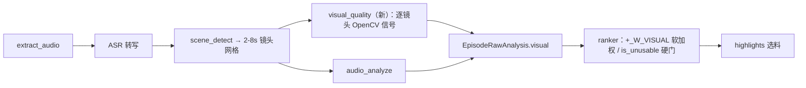

# service/05 · 视觉理解能力补齐设计（P0 切片）

> ⚠️ **实现状态（2026-10-09 设计）**：本文为 **设计意图**，P0 切片**尚未实现**。本文所有「现状」结论均经主理人直接读码核实（见 §0 证据），与代码不符处已显式标注。
> 本切片只做**零新增深度模型的画质信号**，不做人脸/VLM。人脸与 VLM 见 §7 路线图。

## 0. 现状证据（已核实，非推测）

| # | 事实 | 来源 | 对设计的影响 |
|---|------|------|------|
| F1 | `ranker.py:11-13` 权重仅 `_W_CONFLICT=0.5 / _W_ENERGY=0.3 / _W_EMOTION=0.2`，**和为 1.0，无画质项** | `engines/semantic/ranker.py` | 新增视觉信号有真实空位，但插入须重新分配权重使和为 1 |
| F2 | `pipeline.py:19-34` `source_signature() = md5(path\|size\|mtime_ns\|ocr_channel)` 已把通道可用性纳入失效判据 | `engines/analysis/pipeline.py` | 视觉通道须同样并入，否则装模后旧降级结果被误判为新鲜 |
| F3 | `EpisodeRawAnalysis` 仅 `asr_segments / scenes / audio` 三字段；`SceneInfo` 仅 `start/end`（经 `merge_scenes` 规整为 2–8s 镜头网格） | `engines/analysis/models.py` | 视觉产物挂载点 + 对齐网格已存在 |
| F4 | `pyproject.toml` mypy overrides 含 `cv2.*`，但 `ml` 依赖组**未声明 opencv**；全仓 `import cv2` 零命中 | `service/pyproject.toml` + grep | P0 须先补 `opencv` 依赖（半条路已铺） |
| F5 | OCR 通道采样范式：`_SAMPLE_FPS=1.0 / _ROI_WIDTH=800 / _OCR_WORKERS=4 / 探针帧定位` | `engines/analysis/subtitle_ocr.py` | 视觉采样**复用同一骨架**，不自造第二套 |
| F6 | `ModelSpec.kind` 现为 `asr / tts / diarization` | `infra/model_manager/registry.py` | P0 纯 ffmpeg+opencv 不需新 kind；P1 人脸需扩 `vision` |
| F7 | `runner.py` 提供受控列表式 ffmpeg 封装（禁 shell 拼接）+ 错误分类 | `infra/ffmpeg/runner.py` | 纯 ffmpeg 画质信号走同一封装 |
| F8 | `episode_analysis` 表已有 `characters TEXT` 列（当前未写）；`upsert` 对 `ocr_segments/subtitle_band` 用 `COALESCE` 保留旧列；迁移 016 是 `ADD COLUMN ... TEXT` + NULL 语义回退的现成模板；最新迁移号 019 | `infra/storage/repos/analysis.py`、`migrations/016_subtitle_band.sql`、`001_init.sql` | 视觉列须 `ADD COLUMN TEXT`、NULL 语义回退、`COALESCE` upsert、迁移号用 `020_visual_features.sql` |
| F9 | prescreen 四权重 `_W_SCENE=30/_W_VOICE=25/_W_ENERGY=25/_W_MOTION=20` 求和 100 | `engines/analysis/prescreen.py` | 轻量 sharpness 可挂 prescreen（阶段一），与主分析互不冲突 |

## 1. 目标与原则

- **P0 唯一目标**：给选料加一道「画面质量门」，杜绝把模糊/过曝/黑场/卡帧镜头选成高光。
- **零新增深度模型**：全部信号用纯 ffmpeg 探测 + OpenCV 轻量算子，CPU 即跑，无 GPU/权重分发负担，不破坏「素材不出本机」。
- **严格贴合引擎层约定**：纯逻辑、Pydantic 输入输出、不感知 transport、不裸写 SQL（经 repos）、进度经注入 `ProgressReporter`。
- **可回退**：`opencv` 缺失 / 通道关闭时，视觉列一律 `NULL`，消费端回退到现状（无视觉加权），绝不报错。

## 2. 模块与文件清单（P0）

| 文件 | 职责 | 是否新增 |
|------|------|------|
| `engines/analysis/visual_quality.py` | 逐镜头画质信号提取（纯逻辑）：sharpness / exposure / frozen / blackframe | **新增** |
| `engines/analysis/models.py` | 新增 `ShotQuality`、`VisualFeatures`；`EpisodeRawAnalysis` 增 `visual: VisualFeatures \| None` | 改 |
| `engines/analysis/pipeline.py` | 在 `scene_detect` 之后调用视觉；`source_signature` 并入 `visual_channel` | 改 |
| `engines/semantic/ranker.py` | 新增 `_W_VISUAL` 软加权 + `is_unusable` 硬门；权重重分使和为 1 | 改 |
| `infra/storage/migrations/020_visual_features.sql` | `ALTER TABLE episode_analysis ADD COLUMN visual_features TEXT` | **新增** |
| `infra/storage/repos/analysis.py` | `upsert` 增 `visual_features` 参数 + `COALESCE`；`get` 返回该列 | 改 |
| `service/pyproject.toml` | `ml` 组增 `opencv-python-headless>=4.9` | 改 |
| `protocol/schemas/analysis.json` | 增 `visual_features` 字段与 `ShotQuality/VisualFeatures` 类型 | 改 |
| `docs/06-经验参数表.md` | 登记 §3 数值参数 | 改 |

新增 RPC 方法：**不需要**。视觉结果走既有 `episode_analysis` 落库 + 既有分析状态接口返回。

## 3. 数据模型（字段级）

```python
# engines/analysis/models.py 新增
class ShotQuality(BaseModel):
    start: float
    end: float
    sharpness: float = 0.0          # 0-1，Laplacian 方差归一（F5 同 800px 宽）
    over_exposed: float = 0.0       # 过曝像素占比 0-1
    under_exposed: float = 0.0      # 欠曝像素占比 0-1
    frozen: bool = False            # 镜头内帧冻结（卡帧）
    black_frame: bool = False       # 黑场
    is_unusable: bool = False        # 任一硬伤触发即 True → ranker 硬门排除

class VisualFeatures(BaseModel):
    per_shot: list[ShotQuality] = Field(default_factory=list)
    avg_sharpness: float = 0.0
    sampled_fps: float = 1.0        # 复算/核对用
```

`EpisodeRawAnalysis.visual: VisualFeatures | None = None`（None = 通道未跑，等价 F2 未装）。

## 4. 数据流



- 视觉在 `scene_detect` 之后跑，天然对齐镜头网格（F3），不引入新时间轴。
- 采样复用 F5 范式：`_SAMPLE_FPS=1.0`、`_ROI_WIDTH=800`、线程池 4 路。

## 5. ranker 权重改造（F1）

```python
_W_CONFLICT = 0.45
_W_ENERGY   = 0.25
_W_EMOTION  = 0.15
_W_VISUAL   = 0.15    # 新增，四项和为 1.0
```

- **软加权**：某镜头 `sharpness/曝光` 差 → `_W_VISUAL` 项低，综合分被温和压低。
- **硬门（并发）**：`ShotQuality.is_unusable == True`（模糊/黑场/卡帧）→ 该镜头直接从候选剔除，不等权重起效——这是 P0 真正要防的事故（选料选到不可看镜头）。
- 分配理由：视觉是「质量门」不是「相关性」，不应压过冲突/台词/情绪；0.15 足以让清晰替代镜头在冲突相近时胜出不清晰的。

## 6. 失效判据（F2）

```python
# pipeline.py source_signature 改为：
basis = f"{video_path}|{stat.st_size}|{stat.st_mtime_ns}|{int(ocr_channel)}|{int(visual_channel)}"
# visual_channel = opencv 可用且通道已启用（布尔）
```

- 与 `ocr_channel` 完全对称：装了 opencv 但上次是旧降级 → 签名失配 → 强制重分析，旧结果不滞留。

## 7. 依赖与配置（F4/F8）

- `pyproject.toml` `[ml]` 增 `opencv-python-headless>=4.9`（headless 版无 GUI 依赖，桌面端更干净）。mypy overrides 已含 `cv2.*` 无需再改。
- 全局 settings 新增（三层设置架构 → `settings` 表，界面「偏好设置」可改即存）：
  - `analysis.visual_quality.enabled` 默认 `true`
  - `analysis.visual_quality.sample_fps` 默认 `1.0`
  - `analysis.visual_quality.sharpness_min` 默认 `0.35`（低于即判不可用，经验待标定）

## 8. 性能预算（80 集）

- 1 fps × 800px 宽：单集 ~120s → ~120 采样帧；OpenCV Laplacian/直方图在 800px 单帧 <1ms，4 线程并行，单集约 **0.2–0.5s** 纯视觉。
- 80 集全量：额外 **≈ 20–40s CPU**（与 ASR/场景切割相比可忽略）。无 GPU 依赖，CPU int8 同路径。
- 断点续跑：视觉结果随 `EpisodeRawAnalysis` 落库，已 done 的集跳过（既有机制，无需改）。
- 可选增强（不在 P0 范围）：prescreen 阶段一已逐集读帧（F9），可顺带算轻量 `sharpness` 供「推荐集」排序，近乎零成本。

## 9. 契约改动（protocol）

- `protocol/schemas/analysis.json` 增字段 `visual_features: VisualFeatures | null`，类型 `ShotQuality`/`VisualFeatures` 与 TS 侧 `protocol/ts/index.ts` 同步。
- **不新增 RPC 方法**；CI 的 `METHOD_NAMES` 集合相等校验不受影响（无新增方法）。
- 落库 JSON 字段新增属可空、旧库 `NULL` 由 `COALESCE` 兼容，不强制重分析（同 B9 `beats` 兼容写法）。

## 10. 验收标准（真机回归，呼应 `scripts/verify_modes.py` 门禁）

1. **质量门生效**：对 10 种模式各跑一部真剧，选中的高光镜头中 `is_unusable == True` 的占比 = 0（硬门必须排除卡帧/黑场/极模糊）。
2. **可复现**：同素材开/关视觉通道，冲突分与 highlights 除视觉排序外完全一致（确定性）。
3. **失效判据**：切换 `analysis.visual_quality.enabled` 后 `source_signature` 变化 → 触发重分析（回归用例钉死）。
4. **迁移兼容**：在 019 旧库上跑 020 迁移幂等；`visual_features=NULL` 的旧记录仍能加载，其他列经 `COALESCE` 保留。
5. **事故复现反向验证**：人为构造一段「高冲突但模糊」镜头，启用视觉后不再排在清晰替代镜头之前。
6. **门禁不破**：`ruff` / `mypy --strict` / `pytest` / 前端 `tsc --noEmit` 全过（P0 改动不引入 any、不超 300 行/文件）。

## 11. 风险与不做的事

**本切片明确不做**（避免范围膨胀）：
- ❌ 人脸检测 / 跟踪 / 聚类（→ P1，需 ONNX 检测模型 + 扩 `ModelSpec.kind=vision`）
- ❌ VLM 场景语义 / 剧情结构化（→ P2，重模型、违本机延迟预算）
- ❌ 视觉情绪（表情识别）——P0 情绪仍吃 ASR 文本

**可能翻车**：
1. **sharpness 阈值标定**：Laplacian 方差绝对值受分辨率/编码影响，`sharpness_min` 须用真机标定，先给保守默认再调。
2. **F4 依赖落地**：`opencv-python-headless` 与 PyInstaller sidecar 体积/打包需验（headless 体积可控，但 sidecar 构建要重新冒烟）。
3. **黑白/艺术片过曝误判**：过曝占比阈值对高调画面可能偏高，先用「占比 + 均值」双判，必要时回退不加权。

## 12. 路线图（后续切片，非本设计范围）

- **P1 人脸**：`engines/analysis/face_detector.py` + `infra/model_manager` 扩 `kind=vision`；产出说话人视觉锚（辅助 CAM++ 声纹聚类消歧）+ 9:16 竖屏裁切参考。
- **P2 VLM**：仅在文本+音频确实无法覆盖的剧情理解场景引入，且须评估本机延迟与离线可行性。
